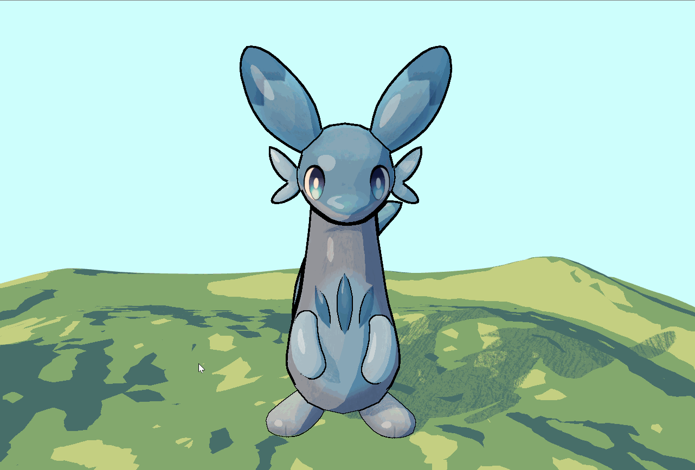

# HW 2: *3D Stylization*

Chillet is charging up, watch out! For this project, I brought a Chillet illustration into Unity with toon shading, outlines, and animated energy bands.

## Concept Art

I used this illustration by [MalachiMoet](https://x.com/MalachiMoet/status/1753367077426282894) as my reference for the colors and overall look.

## Improved Surface Shader & Outlines

I added multiple light support and specular highlights to the toon shader, plus textured shadows for a rougher look. The post-process outlines use depth and normal buffers with Roberts Cross edge detection to help Chillet pop out.

## Special Surface Shader

Animated energy bands move across Chillet's body to give it a charging-up effect. Cute, but probably best to keep your distance.

## Vignette, Interactivity & Extra Credit

I added a vignette inspired by the concept art and some terrain using the same toon shader to give Chillet a little stage.

**Hold Space** to switch to colorful energy bands. Release it to return to the original look. Chillet gets a party mode!

## Credits

- [Concept art — MalachiMoet](https://x.com/MalachiMoet/status/1753367077426282894)
- [Chillet model](https://sketchfab.com/3d-models/chillet-db7686a13b28456da7890a07d91bd916)
- [Shadow texture](https://www.magnific.com/free-photo/grunge-scratched-black-gold-concrete-textured-background_17118085.htm)
